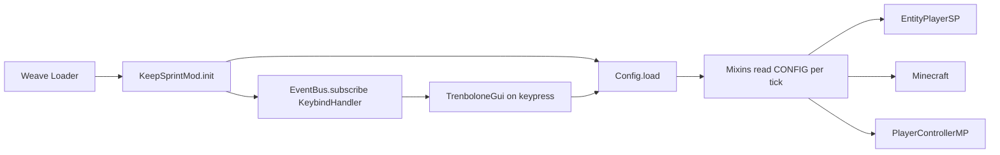

# keep-sprint-mod

**Five Minecraft 1.8.9 movement and interaction modules behind one in-game GUI.**

## Overview

A Java mod for Lunar Client (and plain 1.8.9) injected via [Weave Loader](https://github.com/Weave-MC/Weave-Loader). Reimplements the classic bridging toolkit - KeepSprint, OmniSprint, FastPlace, BlockReach, Timer - each gated behind a config flag and a toggle in the in-game menu.

> Built for solo practice and mechanics research, not for competitive play.

Think of it as **a minimal, readable version of what paid cheat clients ship**. No obfuscation, no telemetry, no anti-debug. Just the physics deltas, exposed as source.

***One keybind opens the panel, one config file on disk, one jar in your mods folder.***

## Quickstart

```bash
git clone https://github.com/alxx/keep-sprint-mod.git
cd keep-sprint-mod
make deploy
```

Then launch Minecraft 1.8.9 (vanilla or Lunar) through [Weave Manager](https://github.com/Weave-MC/Weave-Manager). Press `→` (right arrow) in-game to open the panel.

## Why

Vanilla MC physics drop sprint on direction changes, throttle placement to four ticks, cap reach at 4.5 blocks, and run the game clock at a fixed 20 TPS. Paid cheat clients have been selling their override of these defaults for years. This mod implements the same overrides in ~300 lines of Java, under MIT, so you can read exactly what's happening.

## Features

- **KeepSprint** - Forces the sprint flag on while moving and fed. Preserves sprint through strafe and backwards movement.
- **OmniSprint** - Velocity multiplier on pure strafe or pure backwards inputs. Compensates for vanilla's friction-based momentum loss. Range `1.00x-1.15x`.
- **FastPlace** - Zeroes `Minecraft.rightClickDelayTimer` every tick, enabling one block per tick while holding right-click.
- **BlockReach** - Overrides `PlayerControllerMP.getBlockReachDistance`. Range `4.5-7.0`. Server anticheats typically flag past ~6.
- **Timer** - Multiplier on `Minecraft.timer.timerSpeed`. Range `0.50x-1.50x`. Vanilla is `1.0`.
- **In-game GUI** - Dark panel with module cards, toggle switches, and sliders. Opened via `RIGHT_ARROW`. Save commits to disk, Cancel discards changes.

## Architecture



Five mixins target three Minecraft classes. Config is a single static reference, read by every mixin on every tick. The GUI is a working copy that commits back to disk on Save.

## Build

```bash
make build      # Gradle build, output at build/libs/
make deploy     # Build + copy jar to ~/.weave/mods/
make install    # Alias for deploy
make clean      # Gradle clean
make help       # List targets
```

Requires a JDK 8+ on PATH. The Gradle wrapper handles everything else. Output jar is `trenbolone-bridgonate-0.1.0.jar`.

## Config

Lives at `~/.weave/mods/keepsprint-config.properties`. Auto-created on first run. The GUI is the canonical editor.

```
keepSprintEnabled=true
omniSprintEnabled=false
omniSprintMultiplier=1.0
fastPlaceEnabled=false
blockReachEnabled=false
blockReachDistance=6.0
timerEnabled=false
timerMultiplier=1.0
```

Legacy `tellyMomentumEnabled` / `tellyMomentumMultiplier` keys are still read if the new keys are absent.

## Target

- Minecraft 1.8.9 with MCP mappings
- Weave Loader 1.1.0
- SpongePowered Mixin 0.8.5, compatibility level `JAVA_8`
- Lunar Client (via Weave Manager) or plain 1.8.9

Java 8 is load-bearing. Do not bump the toolchain - 1.8.9's classloader will reject anything higher. Same for the mixin `compatibilityLevel`.

## Credits

- [Weave-MC/Weave-Loader](https://github.com/Weave-MC/Weave-Loader) - Java agent that enables injection into Lunar Client.
- [Weave-MC/Weave-Manager](https://github.com/Weave-MC/Weave-Manager) - Desktop app that attaches Weave to Lunar on launch.
- [Weave-MC/ExampleMod](https://github.com/Weave-MC/ExampleMod) - Reference template for Gradle and mixin wiring.

Reference behaviors were derived from decompiling a publicly distributed jar. Nothing here is copy-pasted bytecode - mixins are reimplementations from observed effects.

## Contributing

PRs welcome. For anything structural, open an issue first.

## License

[MIT](LICENSE)
